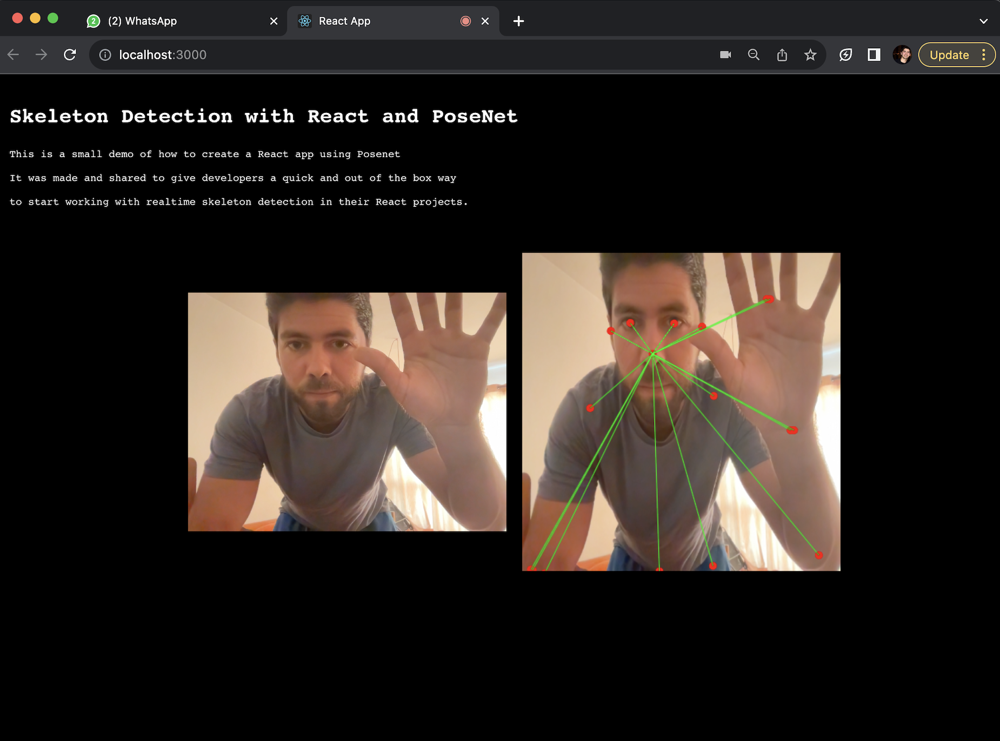

# React Posenet Demo

This is a small demo of how to create a React app that uses Posenet. <br>
It was made and shared to give developers a quick and out of the box way to start working with realtime skeleton detection in their React projects.



## Features

- Webcam Stream
- Single Pose Estimation

## Getting Started

These instructions will give you a copy of the project up and running on
your local machine for development and testing purposes.

### Installing

Navigate to the directory you wish to use

### Clone Repository

```sh
git clone https://github.com/bernabranco/react_posenet_demo.git
```

In the root of the project:

### Install Dependencies

```sh
npm i
```

### Start App

```sh
npm start
```

## Contributing

Any contribution should be done by opening a Pull Request

## Authors

See also the list of
[contributors](https://github.com/bernabranco/PexelsImageSearch/contributors)
who participated in this project.

## License

No License, use it as you please ;)
